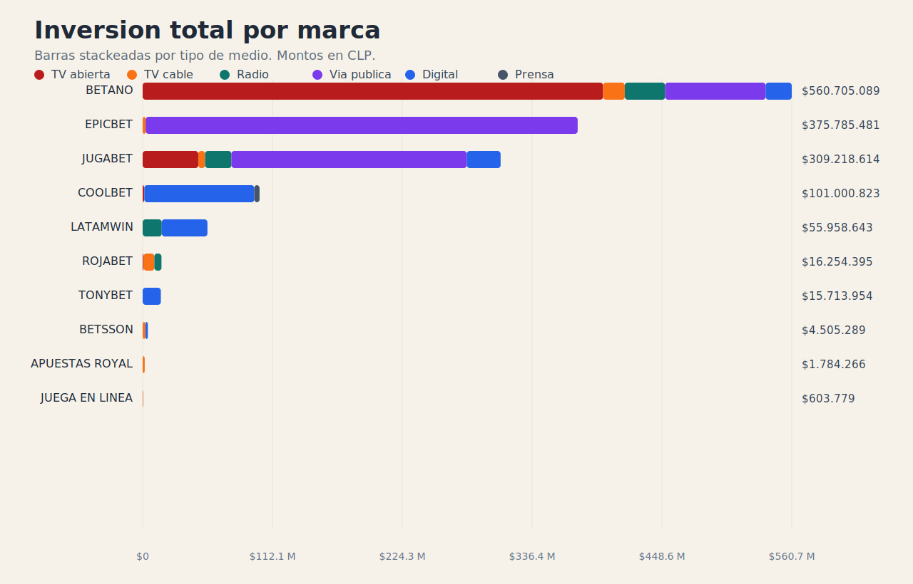
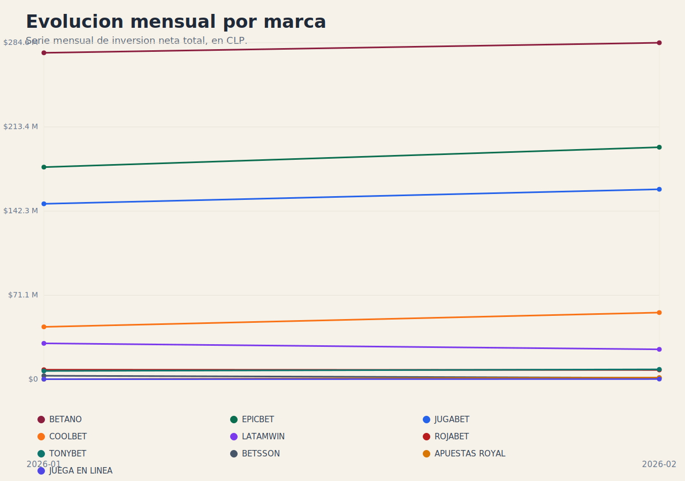

# Observatorio Abierto de Publicidad de Apuestas Online en Chile

## Data Products

Primer data product publicado: inversión mensual por marca en publicidad de apuestas y casinos online observados en Chile.

Los montos están expresados en pesos chilenos (`CLP`) y provienen del archivo fuente [BASE - COMPETENCIA - ENERO Y FEBRERO.xlsx](input/raw/BASE%20-%20COMPETENCIA%20-%20ENERO%20Y%20FEBRERO.xlsx), recibido en crudo y procesado desde la hoja `BASE BRUTA`.

Archivos disponibles:

- [total.csv](output/data_products/inversion_mensual_por_casino_ilegal/total.csv): inversión mensual total por marca.
- [tv_abierta.csv](output/data_products/inversion_mensual_por_casino_ilegal/tv_abierta.csv): inversión mensual por marca en televisión abierta.
- [tv_cable.csv](output/data_products/inversion_mensual_por_casino_ilegal/tv_cable.csv): inversión mensual por marca en televisión de cable.
- [radio.csv](output/data_products/inversion_mensual_por_casino_ilegal/radio.csv): inversión mensual por marca en radio.
- [via_publica.csv](output/data_products/inversion_mensual_por_casino_ilegal/via_publica.csv): inversión mensual por marca en vía pública.
- [digital.csv](output/data_products/inversion_mensual_por_casino_ilegal/digital.csv): inversión mensual por marca en digital.
- [prensa.csv](output/data_products/inversion_mensual_por_casino_ilegal/prensa.csv): inversión mensual por marca en prensa.

## Visualizaciones simples

Formatos pensados para abrir en un navegador comun, sin software especializado:

- [Sitio interactivo en GitHub Pages](https://dna33.github.io/casas_de_apuesta_y_casinos_ilegales/): version publicada de la visualizacion en una sola pagina, con carga automatica del JSON maestro cuando el sitio esta desplegado.
- [inversion_mensual_por_casino_ilegal.html](output/visualizations/inversion_mensual_por_casino_ilegal.html): una sola pagina con barras stackeadas por marca, lineas por mes, tabla resumen y explorador de piezas.
- [inversion_mensual_por_casino_ilegal_summary.json](output/visualizations/inversion_mensual_por_casino_ilegal_summary.json): resumen estructurado para reutilizar los graficos o alimentar otras visualizaciones.
- [master_investment_detail.json](output/master/master_investment_detail.json): JSON maestro detallado que puede cargarse dentro de la pagina HTML para revisar piezas, medios, programas y enlaces de evidencia.

La pagina HTML ya trae un resumen embebido para que abra directo. Ademas permite cargar manualmente el `master_investment_detail.json` y mostrar registros con sus enlaces de evidencia, que en varios casos apuntan a la pieza misma.

Vista previa directa en GitHub:





Repositorio abierto destinado a recopilar, verificar y publicar información sobre **publicidad y presencia en medios chilenos de casinos y casas de apuestas online que no cuentan con autorización legal en Chile**.

El objetivo es **orientar a la ciudadanía**, periodistas, investigadores y autoridades respecto de si la publicidad de apuestas que aparece en transmisiones deportivas, camisetas, medios digitales o eventos corresponde o no a **actividades autorizadas por la legislación chilena**.

Este repositorio busca funcionar como **infraestructura abierta de observación pública**: un espacio donde distintos actores puedan aportar información verificable sobre la presencia de estas plataformas en el ecosistema mediático chileno.

---

## Propósito

En Chile, los juegos de azar requieren **habilitación legal expresa**. Actualmente, las excepciones establecidas por la ley corresponden principalmente a loterías estatales y casinos presenciales regulados.

Durante los últimos años múltiples **plataformas de apuestas online operadas desde el extranjero** han invertido intensamente en publicidad en:

- transmisiones deportivas  
- camisetas de clubes  
- medios digitales  
- televisión y radio  
- redes sociales  
- plataformas de streaming  

Diversos fallos de la Corte Suprema han señalado que estas operaciones **no cuentan con autorización legal en Chile**, lo que ha abierto un debate público respecto de su publicidad, financiamiento del deporte y tratamiento tributario.

Este repositorio busca **ordenar información dispersa y hacerla verificable**.

---

## Objetivos

1. **Catalogar plataformas de apuestas online que operan o se publicitan en Chile.**

2. **Registrar presencia publicitaria observable** en medios chilenos, incluyendo:
   - patrocinios deportivos
   - publicidad en transmisiones
   - campañas en medios digitales
   - publicidad exterior

3. **Vincular cada registro a fuentes verificables**, tales como:
   - prensa
   - transmisiones deportivas
   - registros audiovisuales
   - informes públicos
   - declaraciones corporativas

4. **Crear una base abierta de observación pública** que permita a periodistas, investigadores y ciudadanos consultar información trazable.

---

## Alcance

El repositorio **no tiene fines comerciales ni regulatorios**.

Su objetivo es **documentar información pública verificable** sobre:

- publicidad  
- patrocinio  
- presencia mediática  

de operadores de apuestas online que **no cuentan con autorización legal explícita para operar en Chile**.

---

## Plataformas observadas

Entre las plataformas de apuestas online que han tenido presencia publicitaria en Chile se encuentran:

- Betano  
- Betsson  
- Coolbet  
- 1xBet  
- Betway  
- Bodog  
- Rivalo  
- Jugabet  
- Latamwin  

Entre plataformas de casino online:

- Stake  
- Spin Casino  
- 888casino  
- LeoVegas  

La presencia de estas plataformas en el repositorio **no constituye una acusación**, sino un registro de **actividad publicitaria observable en Chile**.

---

## Marco legal de referencia

Las discusiones sobre la legalidad de estas actividades suelen referirse a normas como:

- Ley 19.995 (casinos de juego)  
- Ley 18.851 (Polla Chilena de Beneficencia)  
- Decreto Ley 1.298 (Lotería de Concepción)  
- artículos 277 y 278 del Código Penal  

Además, distintos fallos judiciales han abordado el funcionamiento y la publicidad de plataformas de apuestas online.

---

## Metodología

Cada registro incluido en el repositorio debe cumplir al menos uno de los siguientes criterios:

- fuente periodística verificable  
- evidencia audiovisual directa  
- declaración corporativa  
- documento oficial  
- informe público  

Toda información debe incluir **referencias trazables**.

---

## Contribuciones

Las contribuciones son bienvenidas.

Para aportar información:

1. Abrir un **issue** describiendo el hallazgo.
2. Adjuntar **fuentes verificables**.
3. Indicar fecha y contexto de observación.
4. Si es posible, aportar evidencia visual.

Las contribuciones serán revisadas antes de incorporarse al repositorio.

---

## Desarrollo futuro

La estructura analítica del repositorio se desarrollará **a partir de los datos efectivamente disponibles**.

En particular, se espera recibir **información desde agencias de medios y otras fuentes del ecosistema publicitario**, lo que permitirá definir posteriormente los productos de datos, indicadores o visualizaciones más útiles para el análisis público.

---

## Estructura técnica inicial

El repositorio ya tiene un primer pipeline operativo para transformar la planilla cruda recibida en un **data product de inversión mensual por marca** y una tabla detallada normalizada.

- `input/raw/`: insumos originales recibidos.
- `input/processed/`: versiones procesadas intermedias.
- `src/`: lógica de carga, validación y normalización.
- `output/master/`: tabla detallada normalizada y reporte de validación.
- `output/data_products/`: productos listos para publicar.
- `docs/input_contract.md`: contrato del input real.

### Ejecución base

Con el workbook actual, el pipeline se ejecuta así:

```bash
python3 src/pipeline.py --input "input/raw/BASE - COMPETENCIA - ENERO Y FEBRERO.xlsx"
```

### Salidas base

- `input/processed/latest_base_bruta.csv`
- `output/master/master_investment_detail.csv`
- `output/master/master_investment_detail.json`
- `output/master/validation_report.json`
- `output/master/qa_report.json`
- `output/data_products/inversion_mensual_por_casino_ilegal/total.csv`
- `output/data_products/inversion_mensual_por_casino_ilegal/tv_abierta.csv`
- `output/data_products/inversion_mensual_por_casino_ilegal/tv_cable.csv`
- `output/data_products/inversion_mensual_por_casino_ilegal/radio.csv`
- `output/data_products/inversion_mensual_por_casino_ilegal/via_publica.csv`
- `output/data_products/inversion_mensual_por_casino_ilegal/digital.csv`
- `output/data_products/inversion_mensual_por_casino_ilegal/prensa.csv`

### Supuesto del primer producto

Para este primer corte, el producto excluye `MONTICELLO` y `XPERTO` del universo “casino/apuesta ilegal”. Ese supuesto está parametrizado en [schema.py](src/schema.py) y puede ajustarse si cambia el criterio editorial.

---

## Motivación

El crecimiento de la publicidad de apuestas online en el deporte ha generado un debate relevante en múltiples países.

La disponibilidad de **datos abiertos, verificables y estructurados** permite mejorar la calidad del debate público y facilitar el análisis independiente del fenómeno.

Este repositorio busca contribuir a ese objetivo.
